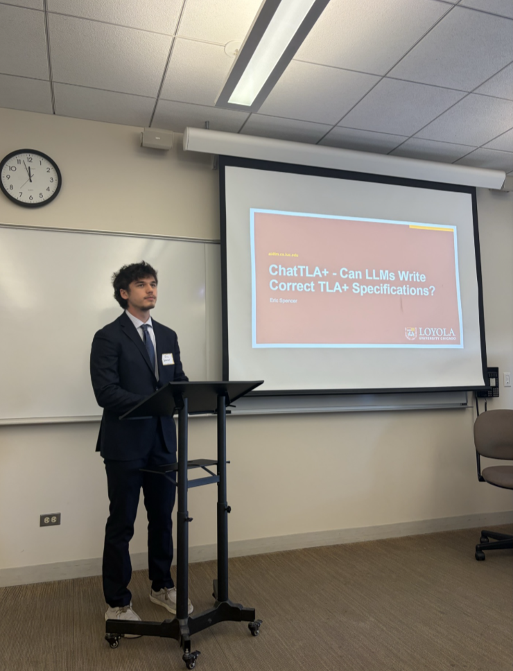

:blogpost: true
:date: April 17, 2026
:author: AB
:category: Research Update
:tags: Formal Methods, TLA+, LLMs, Presentation
:nocomments:

Eric Spencer Presents ChatTLA+ at Loyola University Chicago
============================================================

Eric Spencer presented **ChatTLA+** at the **Undergraduate Research and Engagement Symposium**
at Loyola University Chicago on April 17, 2026 - a talk exploring the use of large language
models for generating and verifying TLA+ formal specifications.

   Eric Spencer presenting ChatTLA+ at the Undergraduate Research and Engagement Symposium, Loyola University Chicago, April 17, 2026.

The presentation covers how LLMs can be applied to TLA+ formal specification generation
and verification, building on the group's ongoing research into evaluating LLMs on formal
language tasks.

`View the presentation (PDF) <../../_static/ChatTLA-presentation-2026.pdf>`__

`Read the full details <../../papers/chattla-2026/>`__
